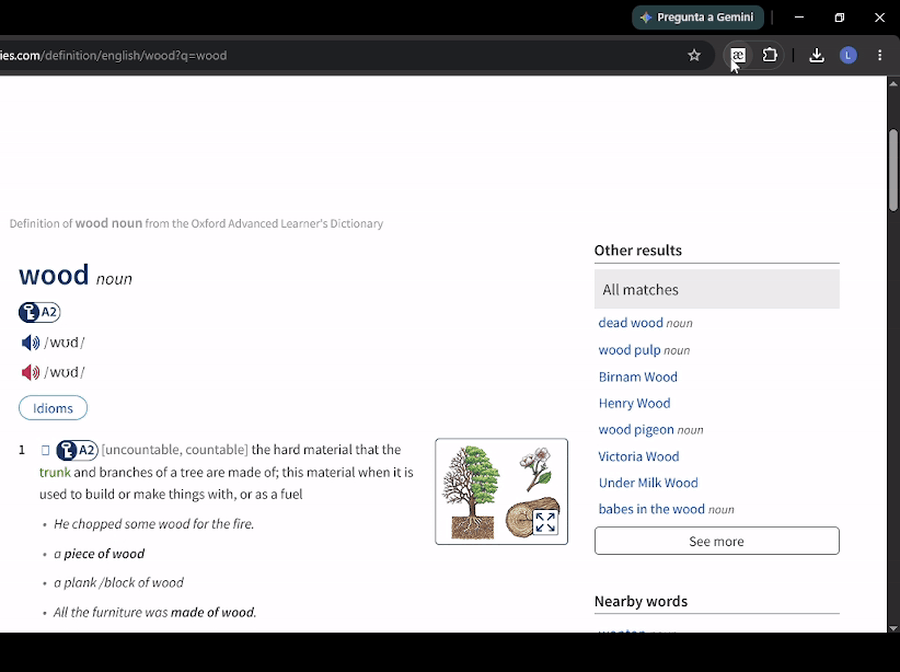

# Words Pronunciation

Extensión de Chrome que descarga el audio de pronunciación de las palabras del Oxford Learner's Dictionaries, en británico y norteamericano, en formato MP3 u OGG.



## Por qué existe

La construí para un problema propio mientras estudiaba inglés. El diccionario reproduce la pronunciación, pero no permite conservarla, y para armar tarjetas de repaso espaciado hacía falta el archivo de audio.

La extensión lee la sección de fonética de la página abierta y ofrece cada pronunciación disponible como descarga directa, con el nombre del archivo listo para importar a una aplicación de tarjetas.

## Instalación

No está publicada en la Chrome Web Store. Se instala compilándola y cargándola sin empaquetar:

```bash
git clone https://github.com/pal0107ma/oxford-download-audio-extension.git
cd oxford-download-audio-extension
npm install
npm run build
```

Después, en Chrome:

1. Abrir `chrome://extensions`.
2. Activar **Modo de desarrollador**.
3. Pulsar **Cargar descomprimida** y seleccionar la carpeta `build/`.

La extensión se activa únicamente en páginas de definición del diccionario (`oxfordlearnersdictionaries.com/definition/english/*`).

## Cómo funciona

Una extensión de Manifest V3 vive en dos contextos que no comparten memoria: el *content script*, que corre dentro de la página y puede leer su DOM, y el *popup*, que es una aplicación aparte y no tiene acceso a esa página. La comunicación entre ambos es el núcleo del diseño.

```
Página del diccionario
        │
        │  content.js lee el DOM al cargar
        │  y guarda las pronunciaciones en memoria
        ▼
   chrome.runtime.onMessage
        ▲
        │  el popup pregunta al abrirse
        │
   Popup (React)  ──►  fetch del audio  ──►  Blob  ──►  descarga
```

**El content script** localiza el contenedor `.phonetics` y recorre sus hijos. Cada bloque de pronunciación expone las URLs de audio en los atributos `data-src-mp3` y `data-src-ogg`, mientras que las etiquetas de variante y la transcripción fonética viven en elementos hermanos. El resultado se agrupa por variante —británica y norteamericana— y queda en memoria a la espera de una consulta.

**El popup**, al abrirse, consulta la pestaña activa mediante la API de mensajería y recibe esa estructura ya procesada. Nunca toca el DOM de la página.

**La descarga** se resuelve con `fetch` sobre la URL del audio y la conversión de la respuesta a un `Blob`, que se entrega al navegador como archivo. Esto evita abrir el audio en una pestaña nueva y permite controlar el nombre del archivo resultante.

## La decisión técnica: dos puntos de entrada sobre Create React App

Una extensión necesita **dos paquetes independientes**: el popup y el content script. Create React App admite uno solo y no expone su configuración de Webpack.

Las salidas habituales son hacer `eject`, lo que congela el proyecto en una configuración que ya nadie actualiza, o armar Webpack desde cero. Elegí una tercera: sobrescribir la configuración con [CRACO](https://craco.js.org/), conservando el andamiaje de CRA y sus actualizaciones.

```js
// craco.config.js
entry: {
  main: [ /* … */ paths.appIndexJs ],
  content: "./src/content.js",
},
output: {
  filename: "static/js/[name].js",
},
optimization: {
  runtimeChunk: false,
},
```

Las dos primeras claves son las evidentes: declarar la segunda entrada y darle a cada paquete un nombre de archivo predecible, porque el manifiesto tiene que apuntar a una ruta fija y no puede seguir los hashes que CRA genera.

`runtimeChunk: false` es la que cuesta descubrir. Por defecto CRA extrae el runtime de Webpack a un archivo aparte que el HTML carga antes que el resto. Un content script no tiene HTML: Chrome inyecta exactamente los archivos que el manifiesto lista, en ese orden y nada más. Con el runtime separado, el content script se compila sin errores y falla en silencio al ejecutarse. Desactivar esa división obliga a que cada entrada sea un archivo autónomo.

## Estructura

```
src/
  content.js                  Lectura del DOM del diccionario y respuesta a la mensajería
  index.js                    Punto de entrada del popup
  App.js                      Consulta a la pestaña activa y orquestación de la vista
  components/
    Phon.jsx                  Bloque de una variante: etiqueta y transcripción
    DownloadAudioBtn.jsx      Descarga de un formato concreto
    PlayAudioBtn.jsx          Reproducción sin descargar
public/
  manifest.json               Manifest V3: popup, content script y permisos
craco.config.js               Configuración de Webpack con las dos entradas
```

## Limitaciones conocidas

- **Depende de la estructura del diccionario.** La extracción se apoya en las clases y atributos de datos del sitio. Un rediseño de la página rompe la extensión, y la corrección pasa por ajustar los selectores del content script.
- **Solo diccionario de inglés.** El content script está restringido a las rutas de definición en inglés; otras secciones del sitio quedan fuera.
- **Sin pruebas automatizadas.** El comportamiento se verificó manualmente sobre páginas reales.
- **Permiso `tabs`.** Se usa para identificar la pestaña activa a la que enviar el mensaje. `activeTab` sería un permiso más acotado para el mismo fin.

## Sobre el uso

Es una herramienta de estudio personal. Descarga archivos que el propio navegador ya solicita al reproducir la pronunciación en la página, y no elude ningún control de acceso ni redistribuye contenido. El material del diccionario pertenece a Oxford University Press; antes de darle cualquier uso que exceda el estudio individual, conviene revisar sus términos de servicio.

## Stack

React · Tailwind CSS · Chrome Manifest V3 · Webpack mediante CRACO